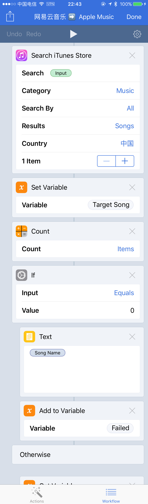
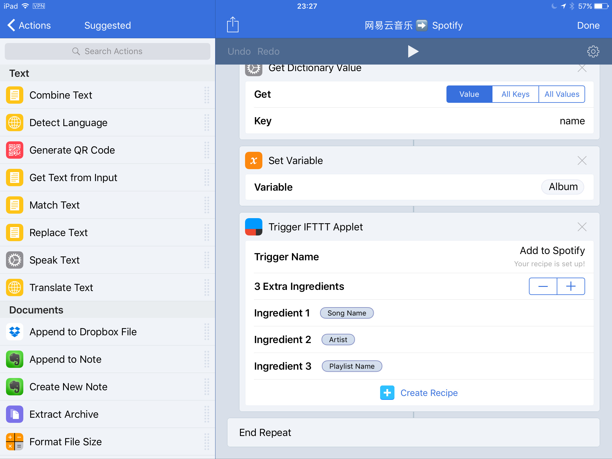
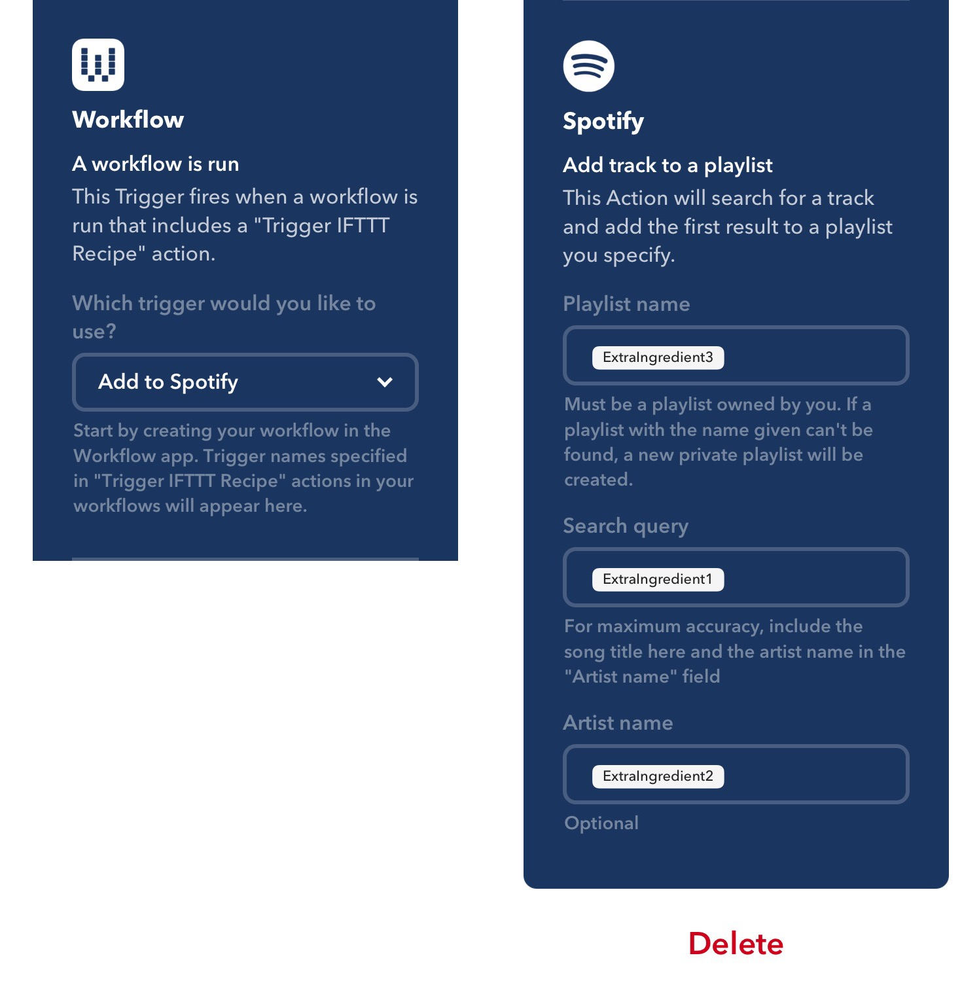

[notice]注意：由于网易云音乐使用的 API 时常变动，文中 Workflow 无法使用时，请在本文下面留言，并附上具体的无法使用的链接，我看到后会尽快排查。另外因为学业繁忙，可能处理不是很及时，还请谅解[/notice]

[notice]2017 年 11 月 29 日更新：修改了转移歌单所使用的网易云音乐 API。新的 Workflow 链接：[网易云音乐➡️ Apple Music](https://workflow.is/workflows/e6a2c81353dd45b3bf3224b027e1a6a7)[/notice]

关于音乐平台的选择，通常可以分为两类人：一是只关心纯净的聆听体验，这类人的音乐平台是[Apple Music](https://sspai.com/post/tag/Apple%20Music)、[Spotify](https://sspai.com/search/?q=spotify) 等；二是在前者之外还喜欢有一些社交元素，比如在评论区参与讨论，这类人的音乐平台则是网易云音乐、虾米等。我之前一直在使用网易云音乐，直到我慢慢意识到听歌是一件非常私人的事，纯净的聆听体验于我可能更重要。

前段时间 Apple Music 推出了针对大学生的特价活动，再加上 Apple Music 相对全面的曲库，想必很多人心里已经在痒痒了，跃跃欲试；另一方面 Spotify 在音乐爱好者之间口碑一向不错，高质量的推荐和基于场景的歌单符合许多人对优秀播放器的定义。但即使这样，我也难以做到从网易云音乐无痛转移，原因则是我在网易云音乐收集的大量歌单。歌单对很多人都很重要，经过长时间聆听、筛选，最终留下来的一定是最能体现自己音乐品味的那部分。这篇文章就为这样一群人而写：想要尝试新的平台、但是无论如何不能放弃自己的珍藏的这群人。

转移大量的音乐，一首一首手动添加自然是不行，这里介绍借用自动化工具 Workflow 和 IFTTT 进行迁移的方法。


## 如何将歌单转移到 Apple Music

先将 [Workflow](https://sspai.com/post/tag/workflow) 链接放到这里： [网易云音乐➡️ Apple Music](https://workflow.is/workflows/e6a2c81353dd45b3bf3224b027e1a6a7)。

使用时在网易云音乐客户端里复制歌单分享链接，然后运行这个 Workflow。

### 分析

取得对应歌单信息的最好方法是利用平台的 API，API 信息查询官方文档一般能找到。对网易云音乐来说，可以用以下 API 获得歌单信息。

`GET http://music.163.com/api/v3/playlist/detail?id=歌单ID&n=5000`

这个 API 里只有一个未知参数：歌单 ID 。这个 ID 也很容易取到，我们给别人发送歌单链接的时候，复制出来的链接都是这样的形式：

```
iOS版：http://music.163.com/playlist/437754500/45408568?userid=45408568
桌面版：http://music.163.com/#/m/playlist?id=437754500&userid=45408568
```

对比这二者，在 Playlist 后面都能发现一串数字，这就是歌单 ID。在实际的情况中，歌单位数不一定是 9 位，可能是其它位数「感谢微博上的 [@Mini_Goooo](http://weibo.com/u/3878234899)」。取数的方法很多，可以用 Split Text 按照 `/` 一个个截断再选择到目标，这里用更简单高效的正则匹配的方法，也就是使用 Match Text 这个动作，Pattern填正则表达式：

`\d{4,11}`

这个表达式的意思就是取得字串中连续的 4 到 11 位数字。这样取的原因是可以避开前面的的 `163`，也能囊括目前我遇到的大部分歌单 ID，如果你要转移的歌单 ID 位数不在这个范围内，对应修改上面括号内的数使之符合你的歌单 ID 位数即可。URL 的格式是歌单 ID 在前面，取第一个结果也就取得了歌单 ID。


重写 API 到这里：

`GET http://music.163.com/api/v3/playlist/detail?id=歌单ID&n=5000`

在这个 URL 后面跟上 Get Contents of URL，Method 选择 GET，运行成功将返回 JSON 格式的数据块。我们只用关注里面的几个 Key：

- playlist，里面包含了返回的歌单数据；
- playlist 下名叫 name 的 key ，里面包含了歌单名称；
- playlist 下名叫 tracks 的 key ， 里面包含了每首歌的信息；
- tracks 下又有一个名叫 name 的 key ，里面包含的是歌曲名；
- tracks 下名叫 ar 的 key ，里面包含歌曲的演奏者。

这些信息在 Apple Music 里创建歌单以及添加歌曲时都会用到。所以用多个 Get Dictionary Value 来取出来。这里解释一下为什么 `ar` 要取 First Item，这是因为有的歌曲演奏者不止一个，为了防止在运行过程中需要手动选择哪一个，就索性只用第一个演奏者。在实际的 iTunes 匹配时一个演唱者也够了。

需要遍历的是歌曲，歌曲信息包含在 `tracks` 里，于是我们需要在 `tracks` 后面跟上 Repeat With Each ，对每首歌都分别取得歌曲名和演奏者，然后在 iTunes 里匹配，取得的结果添加到Apple Music 里，这就是基本逻辑。这里要指出在使用前请保证 Search iTunes Store 里的 Country 要和你的 Apple Music 的所在区域对应，否则会报错。

在实际的应用中，有可能出现匹配不到歌曲的情况，这种情况我们也要处理。这里借用了我之前在微博上看到的一个 Workflow 的思路，来源记不清了。总的来说如果没有找到歌曲，Search iTunes Store 这一步必然不返回结果，于是在这一步后面接上一个 Count Items ，如果值等于 0 ，那就在失败记录里添上一条；如果值不等于零就执行添加到 Apple Music 的动作。 Workflow 结束的地方再把这个失败记录展示出来，便于后期再手动添加。整个 Workflow 就解析到这里。



### 注意事项与存在的问题

经反应有人会遇到这些问题，我把我现在听说过的总结一下。

- 提示遇到「未知错误」请检查 Workflow 是否有权限访问你的 Apple Music 资料库，并保证 Search iTunes Store 里的 Country 与你的 Apple Music 所在区域一致。
- 提示「The requested operation is not enabled for this device」这应该是一个 Apple Music 方面的 Bug，**你可以尝试重启你的设备，或者关闭再重新开启 iCloud 音乐资料库**。一般来说尝试这两步后就能解决。
- Workflow 中途停止检查你要转移的歌单 ID 位数是否出现了我前文说到的问题，另外这个 Workflow 是用来迁移歌单的，不适用于单曲。适用单曲的版本请看文末。

网易云音乐是做得很好的国内音乐平台，但由于一些历史遗留原因，歌曲信息有不少错误、缺失、张冠李戴的情况，再加上 Apple Music 自身的曲库问题，歌曲匹配不到的可能性还是很高的。如果你的 Apple Music 是中区的，平常用网易云音乐听的歌又比较小众，失败率就进一步升高。这一点我也没有办法，只能靠这俩公司自己去完善自己的数据库。

==由于我不再使用 Spotify，因此以下有关 Spotify 的内容暂时不会再更新。内容可能过时，但原理是不会变的，还请自助排查。==

## ~~如何将歌单转移到 Spotify~~

### ~~分析~~

~~有了上文的铺垫，我们已经能够获取到歌单信息了。但是如果要转移到的是 Spotify 还有一点困难：Workflow 中没有对应的 Spotify 的动作。这里可以借助 IFTTT 来完成，用 IFTTT 其实有好处，就是运行速度比较快。~~

~~首先使用 Workflow 获取到歌单的歌单名称，每首歌的歌曲名和每首歌的演唱者，一首一首地传入 IFTTT。~~

~~Workflow 链接：[网易云音乐 ➡️ Spotify](https://workflow.is/workflows/5d3f42b78c8644e8bd25484daaa8a566)~~



~~然后在 IFTTT 中制作一个 Applet，触发条件就是 Workflow 中的 trigger，执行动作是添加到 Spotify，对应填入歌单名，歌曲名和歌手。点击 Workflow 中 Trigger IFTTT Applet 这一步中的 Create Recipe，跳转到 IFTTT 中，如图填写信息即可。~~



## Bonus：如果要转移单曲呢？

经过了前面的分析和实践，转移单曲也是很简单了，不过是改变一下使用的 API 和解析数据的方式。

### 转移网易云音乐单曲到 Apple Music

Workflow 链接：[网易云音乐 ➡️ Apple Music 单曲版](https://workflow.is/workflows/58c8487e1a4f48e09fc31e088b46e5f7)

使用方式，在网易云音乐里复制单曲分享链接，然后运行这个 Workflow。如果添加失败将会将这首歌的信息放进你的提醒事项，方便你后续手动再添加。

### ~~转移网易云音乐单曲到 Spotify~~

~~Workflow 链接：[网易云音乐 ➡️ Spotify 单曲版](https://workflow.is/workflows/d23109c2cf3a4e098b12ee52ff0f11e1)~~

~~同样需要借助 IFTTT 来添加歌曲。在 Workflow 中取得歌曲信息后如图设置 Trigger：~~


~~然后点击 Create Recipe 跳转到 IFTTT 里创建对应的 Applet 即可。~~


## 结语

Apple Music、Spotify、网易云音乐三家各有所长，分享本文的目的是希望大家能更无障碍地愉快玩耍。

另一方面，Workflow 于我而言是能力非凡的自动化工具，工具放在这里，能做到什么事还是看使用者的能力和脑洞。学习成本是有的，不过当用这个工具真正实现了自己的需求，成就感无与伦比。

祝大家在音乐世界玩得开心～