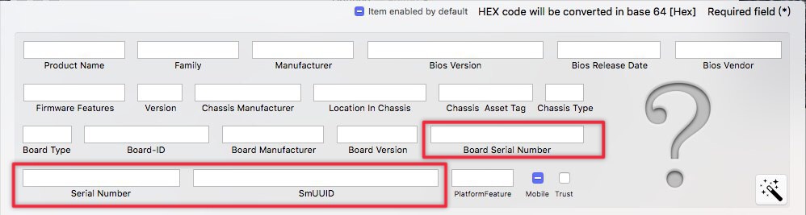

![][1]

在 Hackintosh 上激活 iMessage 费了我好多时间，结果问题出在一个小文件上。

iMessage 的注册是尝试正常使用 Hackintosh 过程中的大坑之一。在 Hackintosh 上使用 iMessage 不是一个简单的登陆过程，系统需要与服务器验证有关本机的一些特殊信息，其中非常重要的有所谓的三码：MLB、ROM、 SmUUID，我习惯再多加一个 Serial Number。这些信息一般存储在一个叫做 NVRAM 的模块中。

其中，MLB 即指 Board Serial Number，SN 是本机序列号，ROM 的值有许多说法，一些人认为这就是网卡的 Mac 地址，SmUUID 是根据你的机器信息生成的唯一值。

为了使 iMessage 能够成功验证通过，以上三个值需要**有效**、且在**每次开机保持不变**。

本机的以上三码信息可以通过 iMessageDebug 这个小工具获得（附在下面，下载双击运行即可）。你可以重启几次观察其值是否一直符合要求：**里面所有的项目需要有确定的、不变的值，不能是 failed 或者全 0 或者全 x。**

符合要求的三码如何获得我没有找到统一的说法，可以自行上网搜索一下。这里说一说注入的问题。

## 如何正确注入三码

我自己是使用 Clover 引导启动。在获得有效的三码之后，使用 Clover Configurator 打开你的 config.plist。在 RT Variables 页（如下图），保证下面的几行空白，BooterConfig 和 CsrActiveConfig 不要动，在 ROM 和 MLB 中填入你获得的值。

在 SMBIOS 页，不要改动其余的信息，仅改动三码部分：Serial Number、SmUUID、Board Serial Number，对应填进去就可以。

在 System Parameters 页，Custom UUID 和 SmUUID 相同，Inject Kexts 选择 Yes，**勾选 Inject System ID**。保存退出。

重启几次使用 imessageDubug 看看这几项值是否已经符合要求，一般来说如果安装过程没有出现问题，那么三码这样注入即可，现在登录 iMessage 应该能够成功激活。

## 仍然无法注入？

我遇到了这种问题，尝试了上面的流程很多遍之后 iMessageDebug 输出我的 MLB 和 ROM 仍然是 failed。网上找了一大圈也没有找到解决方案，最后发现是一个 efi 文件出了问题。

如我以上所述，三码信息存储在一个叫 NVRAM 的模块中，所以要想能够保证注入成功，这个模块首先要能够正常使用。在 Clover 引导中，可以通过 EmuVariableUefi-64.efi（附在下方） 来使之工作。只需要将这个文件拷贝进 EFI/CLOVER/drivers64UEFI 中即可（我之前的问题就是遗失了这个文件），只要你的 config 没有屏蔽掉它，在开机时会自动加载。

参考：[How to fix iMessage](https://www.tonymacx86.com/general-help/110471-how-fix-imessage.html)。

文中提到的文件：

[iMessageDebug](https://pan.baidu.com/s/1cGTrsU)，密码 cikf；

[EmuVariableUefi-64.efi](https://pan.baidu.com/s/1qXEO8u4)，密码 rx7n。

  [1]: ./assets/5cc2bdf89e900.jpg