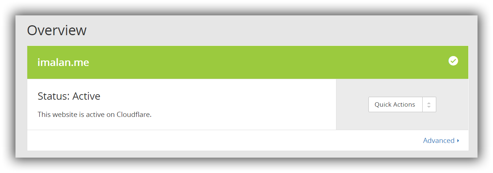
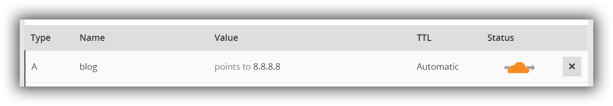
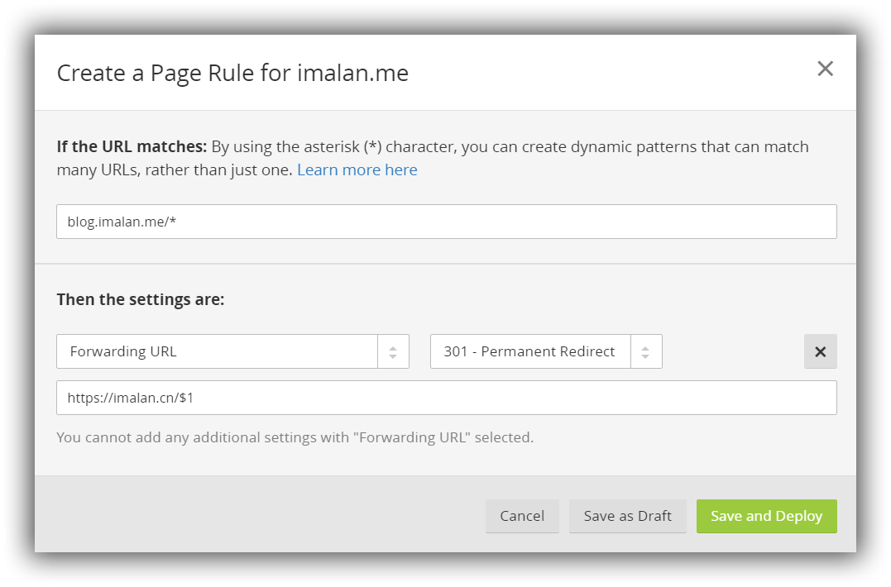

~~到「来动手吧」之前都是废话。~~

 更换域名之后有许多问题需要处理。比如原来散布在网上的各种链接统统变成了死链，如果就这么鲁莽地开一个新站的话，由于内容与原域名指向的内容重复，非常不利于 SEO（虽然对我这种站来说 SEO 什么的不存在的）。这种全站迁移的情况，不论是百度还是 Google 都建议用 301 永久重定向的方式来告诉搜索引擎：我的内容换地方了！

本文适用于这种情况：迁移站点，但是原域名无法解析到某个服务器端做跳转（比如原域名没有备案，无法解析到国内服务器，然而穷逼又没钱不想买国外服务器……）。

### 几个名词解释

关于 301 重定向，维基百科的解释：

> **301 Move Permanently** 是[HTTP协议](https://www.wikiwand.com/zh/HTTP%E5%8D%8F%E8%AE%AE)中的一个状态码（Status Code）。可以简单地理解为该资源已经被永久改变了位置，通常会发送[HTTP Location](https://www.wikiwand.com/zh/HTTP_Location)来[重定向](https://www.wikiwand.com/zh/%E9%87%8D%E5%AE%9A%E5%90%91)到正确的新位置。
>
> 返回 301 请求码进行跳转被[Google](https://www.wikiwand.com/zh/Google)认为是将网站地址由 HTTP 迁移到 [HTTPS](https://www.wikiwand.com/zh/HTTPS) 的最佳方法。

总的来说就是客户端在请求服务器资源时，比如一个 HTML 静态网页，服务器返回这么一个状态码告诉客户端，这个文件已经不在我这里了，你得去某某地儿找。这种方式对搜索引擎更友好，Google 在爬网页时，遇到了 301 就会自动去新位置索引，并逐渐降低原始链接的展现权重。

301 重定向与添加 CNAME 记录是不同的概念。虽然最终都会把你带到一个新的资源位置，但是 CNAME 是 DNS 方面的概念，而 301 重定向是 HTTP 协议的概念。最明显的区别在于，301 重定向将改变地址栏的链接，而 CNAME 不会。

某些提供 DNS 解析的服务措辞可能引起歧义。比如 DNSPOD 在添加域名解析时提供「显性URL」，可以实现 301 跳转的效果，跟别的 DNS 解析设置放一起让人有些混淆。但这实际上并不是在搞域名解析服务，DNSPOD 也只是借助自己的服务器做了一个 301 跳转罢了。并且似乎 DNSPOD 的显性 URL 是付费项目，并且不支持通配符。

关于 CloudFlare，来自百度的介绍：

> Cloudflare以向客户提供网站安全管理、性能优化及相关的技术支持为主要业务。通过基于反向代理的内容传递网络(ContentDeliveryNetwork,CDN)及分布式域名解析服务(DistributedDomainNameServer)，Cloudflare可以帮助受保护站点抵御包括拒绝服务攻击(DenialofService)在内的大多数网络攻击，确保该网站长期在线，同时提升网站的性能、访问速度以改善访客体验。

总的来说，提供 CDN 和 DNS 服务，对许多博主来说应该都不陌生了。CloudFlare 的用法蛮多的，比如利用它来给自己的网站套上一层免费 SSL 等等，不在本文讨论范围。

### 来动手吧

很简单。

打开 CloudFlare 网站：[https://www.cloudflare.com/](https://www.cloudflare.com/) 。注册，登录，并点击 Add Websites，输入你要处理的域名。注意必须是顶级域名，比如 a.com 这样的。点击 Begin Scan，CloudFlare 会扫描你原域名的 DNS 记录，扫描完成后点 Continue Setup。

在 DNS 列表检查是否你原域名所有的 DNS 记录都在，不在的自己补上就好。然后点 Continue。

选择 Free Website 选项，点 Continue。

注意这一步很重要，CloudFlare 比较烦的一项就是必须把原域名的域名服务器改成它们的，所以它才需要扫描你的所有 DNS 记录。CloudFlare 的域名服务器为：

```
amir.ns.cloudflare.com
lisa.ns.cloudflare.com
```

在你的域名注册商那里就可以改，改完后点击 Continue，静待域名服务器更改生效。



在 Overview 这一栏如上图显示 Active 即可。

然后在 DNS 这一栏中查看 DNS 记录。**将你要跳转的域名解析到一个有效的 IP，比如 8.8.8.8 。不要解析到国内的服务器 IP，否则依然是分分钟提示你没备案。**

在这里，我要将 blog.imalam.me 跳转到 imalan.cn。所以如图设置：



重点来了：**添加 Page Rules** 。

Page Rules 是 CloudFlare 的一项特色服务，可以根据设定的匹配规则来对请求进行处理，其中就包括重定向，支持通配符匹配。

这里举例说明，如果我要把 http://blog.imalan.me/xxxx 和 https://blog.imalan.me/xxxx 统统重定向到 https://imalan.cn/xxxx，那么就应该这样设置：在 Page Rules 这一栏，点击 Create Page Rule。

第一项填要处理的 URL，这里我填 `blog.imalan.me/*` 。就是指不论是 HTTP 还是 HTTPS，域名是 blog.imalan.me，后面的 * 是通配符，匹配任意字串。点击 Add A Setting，选择 Forwarding URL，Status Code 选择 301 。在下面输入要跳转到的 URL。这里我输入：`https://imalan.cn/$1` 。`$1` 是前面 * 匹配出的字串，按顺序依次编号 `$1`  ,`$2` ……。结果如下：



点击 Save and Deploy 就完事了。

注意如果添加多条 Page Rule 要注意前后顺序，CloudFlare 对每次访问只会按顺序执行符合的第一条 Rule。

CloudFlare 的其他用法以后看情况（心情）再介绍吧，祝搞机愉快。