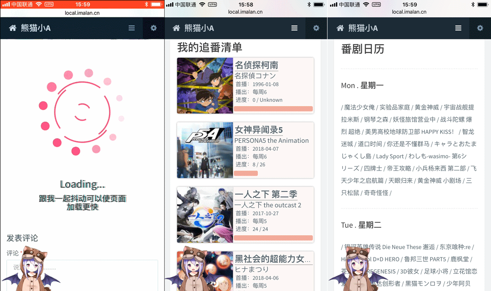

追番功能已经有了升级版的插件，功能更完善，见[熊猫追番 (PandaBangumi) for Typecho 发布！](https://blog.imalan.cn/archives/128/)

-----

这是一个我 顺手（花了大半天） 撸出来的独立页模板，可以从 <a href="http://bangumi.tv/">Bangumi 番组计划</a> 拉取你的追番数据，包括收藏的剧集和观看进度，并（我觉得还算能看地）展示出来。另外也可以选择性地打开追番日历的功能，打开之后会展示每天播出的剧集，并自动加粗已经在观看的剧集。页面效果：



这个项目首先源于友链列表里的[梓喵出没](http://www.azimiao.com/)大佬写过一篇[Bangumi的几个API及使用PHP调用的简单测试](http://www.azimiao.com/2768.html) ，是写在 Bangumi 出公开 API 之前的，文中的方法目前还可以用。加载动画是直接照搬的 [广树](https://www.wikimoe.com/) 大佬的文章。加载文字抖动的 CSS 则是来自 [保罗](https://paugram.com/) 大佬的 [让你的网站文字“抖”起来](https://paugram.com/coding/shake-your-text.html) 。

……没错，代码基本靠抄哈哈。我没有做过前端也不会 PHP，~~全凭一腔热血~~ 。

说回正事，这个模板适用于 handsome 主题，目前 4.3.1 是 OK 的，别的主题可能要自己改改。

### 食用方法

首先，你需要一个 <a href="http://bangumi.tv/">Bangumi 番组计划</a> 的账号，并在里面收藏你在看的番剧。关于这个站点请看：[http://bangumi.tv/about](http://bangumi.tv/about) 。
然后，去 GitHub 上下载两个文件：`Bangumi.php` 与 `getBangumi.php` 。

[https://github.com/AlanDecode/BangumiList](https://github.com/AlanDecode/BangumiList)

之后在 `getBangumi.php` 的起始部分填写账号密码：

```
<?php

/********   填写这里   *********/

$email="这里填写账号邮箱";
$password="这里填写密码";
?>
```

**账号、密码仅供拉取数据使用，我不会收集你的信息。**

将这两个文件放在 **主题根目录下**。

去 Typecho 后台新建独立页面，链接随便填，自定义模板选择 `追番清单` 。如果要开启显示追番日历的功能的话，在下面自定义字段里增加一个叫 `showCal` 的字段，类型是字符，值可取 `top` 或者 `bottom`，分别对应日历列表相对追番列表的位置 。

发布页面即可。

### 注意事项

* 非 handsome 主题的用户请自行修改。
* 模板会向 主题目录/assets/json/bangumi.json 文件写入缓存数据，请保证这个文件可写。
* 换新版本的话记得把原来的 主题目录/assets/json/bangumi.json 文件删掉。

### 更新记录

* 完全重写了样式，使用异步加载，添加了加载动画～
* 增加了自定义追番日历位置的功能。
* 增加了追番日历的功能。


祝使用愉快。