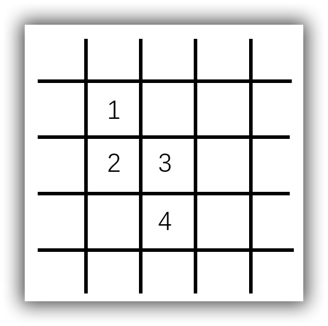
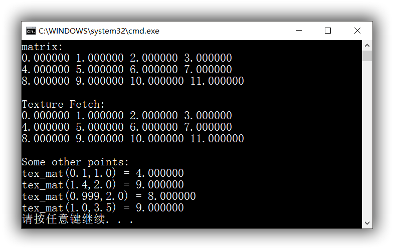
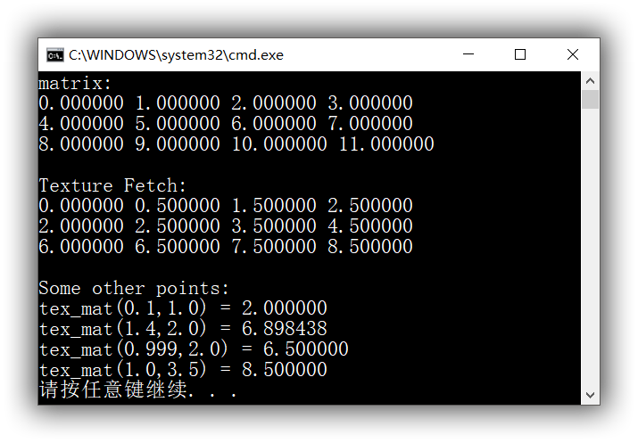

CUDA 中有不同的内存类型，包括全局存储（Global Memory）、共享存储（Shared Memory）、常数存储器（Constant Memory）、寄存器（Register）等。这些不同类型的存储器在物理位置、访问效率上各有不同，因此适合不同的应用场景，这里不展开。这篇文章主要介绍一种存储器：纹理存储器（Texture Memory），以及如何使用它加速访问线性内存与 CUDA 数组（Array）。

*本文大部分内容来自网络，我做了一些调整，加了一个例子。我经常解决了一个问题之后下次又碰到一样的问题，然后又是一翻搜寻。在那种时候我总是会想：“我当时有写文章就好了”，所以我觉得还是把平日里遇到的小问题、看到的好文章都整理整理总结总结，积少成多，对精进技术应该会有帮助。*

## 纹理存储器（Texture Memory）

### 纹理存储器是什么

首先明确：纹理存储器是一种只读存储器，由 GPU 用于纹理渲染的图形专用单元发展而来。它同样位于显存中，但是在访问时有许多优秀的特性，例如可通过纹理缓存加速读取。相对同样具有缓存功能的常数存储器（Constant Memory），纹理存储器可以绑定更大的数据，并且支持一维、二维、三维纹理，并可以通过浮点数寻址。由于纹理存储器转为图像纹理渲染而设计，它特别适合图像处理、查找表等，对随机访问与非对齐访问有良好的加速效果，并且可以按需在返回时同时进行滤波等操作。一个很直观的例子，下面的矩阵中 1,2,3,4 四个数据在行优先的线性存储中并不具有相邻的物理地址，因此连续索引这些数据效率是低下的；但是纹理存储可以在读取其中某个数据时将临近的值载入缓存（Cache），这样下次访问时，则可以直接命中缓存，减少对 Global Memory 的访问，从而提高效率。



对程序员来说，纹理存储是透明的，程序员无需关心内部实现。

在 CUDA 内核函数（Kernel Code）中访问纹理存储器称作纹理拾取（Texture Fetching），作为纹理存储的特性，纹理拾取与普通的访问某一显存地址的数据有很大不同。纹理拾取时采用的坐标可以不同于数据在存储中的真实地址，二者间的转换通过纹理参照系（Texture Reference）来约定，将显存中的数据与约定的纹理参照系关联的操作称为纹理绑定（Texture Binding）。可以与纹理绑定的数据有两种：显存中的线性内存（Linear Memory）和CUDA数组（Array）。线性内存只能与一维纹理绑定，CUDA 数组则可绑定一维、二维、三维纹理。

关于纹理缓存，它有两个作用。首先纹理缓存中的数据可被复用，当访问的数据已经位于缓存中时，访问该数据将命中缓存，减少对 Global Memory 的访问；其次纹理存储可以将拾取坐标附近的几个像元缓存起来，并可以在拾取时进行插值。

关于纹理缓存需要注意的点：由于纹理缓存是只读的，如果你更改了绑定到纹理缓存的数据，纹理缓存中的数据可能并没有被更新，此时拾取到的可能是错误的数据。因此每次修改原始数据都要重新绑定。对绑定 CUDA 数组时不存在此问题（Device 端 CUDA 数组是只读的），但绑定线性内存则要特别注意。

### 纹理拾取（Texture Fetching）

访问纹理中的数据的过程称作纹理拾取。对绑定线性内存的纹理，拾取纹理的坐标只能是定点型、坐标与内存的真实偏移量（Offset）相同。对绑定 CUDA 数组的纹理，拾取坐标是浮点型，并支持许多特殊功能。

**浮点形式寻址：**访问时采用浮点型的坐标对纹理进行寻址，也就是说坐标无需是整数。寻址的方式可以使归一化或者非归一化的。对一个坐标范围是 [0:N]*[0:N] 的纹理，当使用归一化的寻址方式时，每个维度上的坐标被映射到 [0.0:1.0f) 的范围中；使用非归一化寻址时，将被映射到 [0.0:N.0f) 的范围内。当访问的坐标不在一个像元的中心时，根据选择的滤波模式不同，将返回不同的值。

**滤波模式：**仅对绑定 CUDA 数组的纹理有效。当使用浮点型的坐标寻址纹理时，将根据设定返回不同类型的值。设定可以有：最邻近取样模式（**这里存疑，因为我自己试了一下似乎也不是最近邻，而是直接对坐标取 floor**）和线性滤波模式，这无需多说。需要注意的是，当开启了线性滤波模式时，要对访问的坐标多加注意，注意不要因为线性插值的原因得到错误的值，例如当要访问原本是 (i,j) 的坐标时可能需要转为 (i+0.5f,j+0.5f)，我在 StackOverflow 上看到对这个特性的讲解（自己翻译了一下）：

> 在图形学中，纹理指的是用于描述一个平面的采样点集。也就是说，纹理中的一个点指的就是这个平面在此处的采样，并不存在大小，这就与像素（Pixel）不同，一个 Pixel 是具有空间大小的。
>
> 因此 +0.5f 操作保证寻址的位置正好是真正的整数点对应的位置。

对于最近邻插值得返回值当然无此限制。

**寻址模式：**仅对绑定 CUDA 数组的纹理有效，规定了当寻址的坐标超出允许的寻址范围时的行为。有钳位模式与循环模式两种。钳位模式下，当寻址坐标超出了边界，则钳位到最近边界；循环模式下，则是做求模处理。例如纹理坐标范围 [0,1)，访问 1.25 时，钳位模式返回 0.999……处的值，循环模式返回 0.25 处的值。

**类型转换：**当像元中数据是 8 bit 或者 16 bit 时，可对拾取的值进行类型转换，映射到 [0.0f,1.0f] 或者 [-1.0f,1.0f]。

-------

**若要使用纹理内存，大致分为这么几步：首先在 Host 端声明要绑定的线性内存或者 CUDA 数组；其次设置好纹理参照系；然后将纹理参照系与线性内存或者 CUDA 数组绑定；最后在 Kernel 代码中访问纹理内存即可。**

------

## CUDA 数组（Array）

显存中可以分配的空间有两种：线性内存和 CUDA 数组，都可以与纹理参照系绑定，但是 CUDA 数组对纹理拾取有优化，并且在设备端只能通过纹理拾取访问。

### cudaChannelFormatDesc

在声明一个 CUDA 数组前，首先要以结构体 `cudaChannelFormatDesc` 设置 CUDA 数组的数据类型。

```cpp
struct __device_builtin__ cudaChannelFormatDesc
{
    int                        x; /**< x */
    int                        y; /**< y */
    int                        z; /**< z */
    int                        w; /**< w */
    enum cudaChannelFormatKind f; /**< Channel format kind */
};
```

其中，`x,y,z,w` 表示返回每个成员的位数，`cudaChannelFormatKind`表示成员类型，这是一个枚举类型，可以取值：

`cudaChannelFormatKindSigned`：有符号整型

`cudaChannelFormatKindUnsigned`：无符号整型

`cudaChannelFormatKindFloat`：浮点型

`cudaChannelFormatKindNone`：无类型

 `cudaChannelFormatDesc` 可以用一个简单的函数构造：`struct cudaChannelFormatDesc cudaCreateChannelDesc(int x, int y, int z, int w, enum cudaChannelFormatKind f);`。在只需要类型信息时，可以使用简化版的：`struct cudaChannelFormatDesc cudaCreateChannelDesc<T>();`。

### cudaExtent

然后需要确定 CUDA 数组的纬度与尺寸。纬度与尺寸通过一个结构体 `cudaExtent` 描述：

```cpp
struct __device_builtin__ cudaExtent
{
    size_t width;     /**< Width in elements when referring to array memory, in bytes when referring to linear memory */
    size_t height;    /**< Height in elements */
    size_t depth;     /**< Depth in elements */
};
```

成员分别代表长宽高。可以用一个函数来构造：`struct cudaExtent make_cudaExtent(size_t w, size_t h, size_t d)`。

### 为 CUDA 数组分配空间

CUDA 数组可通过 `cudaMalloc3DArray()` 或者 `cudaMallocArray()` 分配空间。其中， `cudaMalloc3DArray()` 可分配一维、二维、三维空间，而 `cudaMallocArray()` 一般用于分配二维数组。使用完数组后，需要使用 `cudaFreeArray()` 释放空间。

### 拷贝数据到 CUDA 数组

对普通线性内存，使用 `cudaMemcpy()`，对 CUDA 数组使用 `cudaMemcpy2D()`、`cudaMemcpy3D()`。注意这里可能比较 tricky，根据显卡的性能和资源限制，拷贝的大小不能过大。

## 纹理参考系（Texture Reference）

### 纹理参考系声明

纹理参考系中的某些属性需要在编译期确定。texture 类型继承自 textureReference，类似这样构造：`texture<T, texType, cudaTextureReadMode> tex;`。

`T` 指明由纹理拾取返回的数据类型。可以是基本整形，或者单精度浮点型组成的 1-，2-，4- 元组向量类型。

`texType` 指明了纹理排布方式。取值：`cudaTextureType1D`、`cudaTextureType3D`、`cudaTextureType3D`、`cudaTextureType1DLayered`、`cudaTextureType2DLayered`等。

`cudaTextureReadMode` 可取值 `cudaReadModeNormalizedFloat` 或者 `cudaReadModeElementType`，本参数可选，缺省 `cudaReadModeElementType`。当取 `cudaReadModeNormalizedFloat` 时，若 T 为整型，视 T 是否有符号则将被映射到 [-1.0f,1.0f]或者 [0.0f,1.0f]。 `cudaReadModeElementType`不对输出转换。

### 设置运行时的纹理参考系属性

除以上需要在编译器确定的属性外，纹理参考系有可在运行时确定的属性：

```cpp
struct __device_builtin__ textureReference
{
    int                          normalized;
    enum cudaTextureFilterMode   filterMode;
    enum cudaTextureAddressMode  addressMode[3];
    struct cudaChannelFormatDesc channelDesc;
};
```

`normalized`：返回是否归一化，如上文所述。对一个坐标范围是 [0:N]*[0:N] 的纹理，当使用归一化的寻址方式时，每个维度上的坐标被映射到 [0.0:1.0f) 的范围中；使用非归一化寻址时，将被映射到 [0.0:N.0f) 的范围内。

`filterMode`：滤波模式。仅对绑定 CUDA 数组的纹理有效。当使用浮点型的坐标寻址纹理时，将根据设定返回不同类型的值。设定可以有：`cudaFilterModePoint`和`cudaFilterModeLinear`。分别表示最近邻插值（**如上文所述，存疑。我觉得好像是直接对浮点坐标做了 floor**）和线性插值。

`addressMode[3]`：寻址模式，即如何处理越界的纹理坐标。可设置：`cudaAddressModeClamp`和`cudaAddressModeWrap`。Clamp 即钳位模式，Wrap 为循环模式。循环模式只支持归一化的纹理坐标。

`channelDesc`：描述纹理返回值类型，同 CUDA 数组部分的内容。

### 纹理绑定

使用 `cudaBindTextureToArray();` 或者 `cudaBindTexture();` 或者 `cudaBindTexture2D();`。

取消绑定：`cudaUnbindTexture()`。

### 纹理拾取

根据不同的纹理类型，采用不同的方式来拾取。与线性内存绑定的纹理，使用`texfetch1D()`来拾取；对 CUDA 数组，使用 `tex1D()`、`tex2D()`、`tex3D()`来拾取，并使用浮点坐标。

## 一个例子

举个例子，当前有一个 `float matrix[3][4]` ，将其载入显存，分配为 CUDA 2D 数组，作为纹理使用，并在 kernel code 中拾取。假设当前 matrix 已经初始化完毕。

### 代码

纹理声明：

```cpp
texture<float,2,cudaReadModeElementType> tex_mat;
```

Host Code：

```cpp
int main()
{
	...
	
    cudaError err;
    cudaArray *arr_mat;
    cudaChannelFormatDesc channelDesc = cudaCreateChannelDesc<float>();
    cudaMallocArray((cudaArray**)&arr_mat,&channelDesc,4,3);
    err = cudaMemcpyToArray(arr_mat, 0, 0, matrix, 3 * 4*sizeof(float), cudaMemcpyHostToDevice);
    if (cudaSuccess != err)
        printf("CUDA ERROR : %s \n", cudaGetErrorString(err));

    tex_mat.normalized = 0;
    tex_mat.filterMode = cudaFilterModePoint;
    //tex_mat.filterMode = cudaFilterModeLinear;
    tex_mat.addressMode[0] = cudaAddressModeClamp;
    tex_mat.addressMode[1] = cudaAddressModeClamp;
    tex_mat.addressMode[2] = cudaAddressModeClamp;
    tex_mat.channelDesc = channelDesc;

    err = cudaBindTextureToArray(tex_mat, (cudaArray*)arr_mat,channelDesc);
    if (cudaSuccess != err)
        printf("CUDA ERROR : %s \n", cudaGetErrorString(err));

    dim3 dimBlock = dim3(4, 3, 1);
    dim3 dimGrid = dim3(1, 1, 1);

    texture_fetching <<<dimGrid, dimBlock >>> ();

    err = cudaUnbindTexture(tex_mat);
    if (cudaSuccess != err)
        printf("CUDA ERROR : %s \n", cudaGetErrorString(err));
    
    err = cudaFreeArray(arr_mat);
    if (cudaSuccess != err)
        printf("CUDA ERROR : %s \n", cudaGetErrorString(err));
	
    ...
}
```

Kernel Code：

```cpp
__global__
void texture_fetching()
{
    int i = threadIdx.y;
    int j = threadIdx.x;

    if (i == 0 && j == 0)
    {
        printf("Texture Fetch:\n");
        for (float idxy = 0; idxy < 3; idxy++)
        {
            for (float idxx = 0; idxx < 4; idxx++)
            {
                printf("%f ", tex2D(tex_mat, idxx, idxy));
            }
            printf("\n");
        }
        printf("\nSome other points: \n");        
        printf("tex_mat(0.1,1.0) = %f\n", tex2D(tex_mat, 0.1, 1.));
        printf("tex_mat(1.4,2.0) = %f\n", tex2D(tex_mat, 1.4, 2.));
        printf("tex_mat(0.999,2.0) = %f\n", tex2D(tex_mat, 0.999, 2.));
        printf("tex_mat(1.0,3.5) = %f\n", tex2D(tex_mat, 1., 3.5));
    }
}
```

### 结果

当 `tex_mat.filterMode = cudaFilterModePoint;` 时输出：



当 `tex_mat.filterMode = cudaFilterModeLinear;` 时输出：

