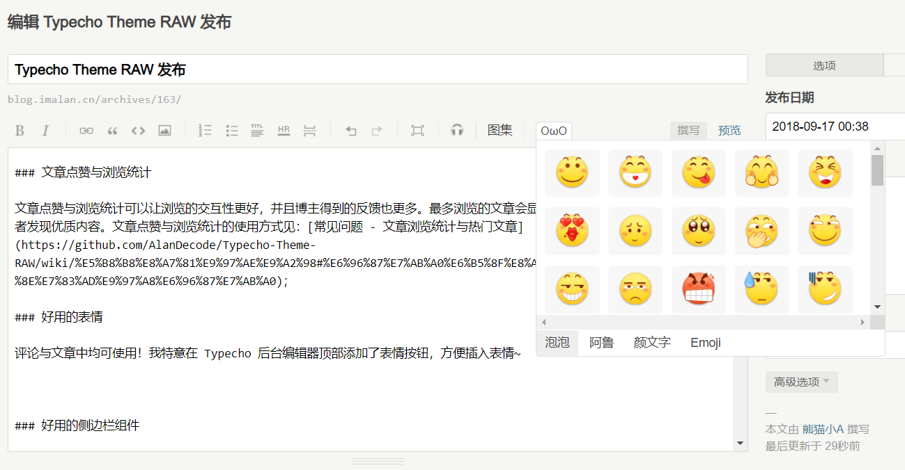

[notice]我目前已经没有使用 RAW，因此这个主题转入维护性更新阶段。也就是说它在未来仍然可能收到 bug 修复这样的更新，但是大概率不会有新的功能了。另外，我会在近期重写这个主题的代码，但同样，只是代码层面上的更改，使用上与当前不会有什么变化。[/notice]

**[项目地址](https://github.com/AlanDecode/Typecho-Theme-RAW) | [开始使用](https://github.com/AlanDecode/Typecho-Theme-RAW/wiki/%E5%BC%80%E5%A7%8B%E4%BD%BF%E7%94%A8) | [常见问题](https://github.com/AlanDecode/Typecho-Theme-RAW/wiki/%E5%B8%B8%E8%A7%81%E9%97%AE%E9%A2%98) | 欢迎给我 star 与各种 PR！**

> Theme RAW 交流群已建立，目前处于无人打理的自由水状态，欢迎进群讨论：777536599

这个主题叫做 RAW，我花了一个周末写出了这个主题的第一版，考虑到我前端零基础[^其实后端也是零基础，但我觉得前端部分要繁琐得多…]的事实，效率应该还算可以。不过后期删删改改，增添了许多功能，花的时间就不是一个周末而已了。

自 2017 年入坑个人博客至今，我稳定使用过 [handsome][1] 和 [Mirages][2] 主题；也短暂地使用过 [Moricolor][3]；购买过 [Yodu][4] 和 [Giligili][5] 主题，但都未曾长时间使用；短暂地迁移到 Hexo 时用的是自己修改后的 [hexo-theme-cactus](https://github.com/probberechts/hexo-theme-cactus) 。

我想自己写一个主题已经很久了。以上说的主题很受欢迎，完成度高，用起来很舒服，只是不能满足我想要自己折腾的冲动。一者，成品（甚至收费的）主题代码都很工程向，功能繁杂，我想插手改动并不容易；二者，在别人的基础上做些修修补补的工作总觉不够味。因此，何不自己写一个呢？所以有了这个主题。

写到一半时我突然担心没办法开源了，因为写完之后左顾右看总觉得和别的主题雷同。直到我又花了几天做出了差异性的地方，才敢斗胆把这个主题放出来。大概因为这毕竟是我的第一个主题，不能让她烂在我手里了。另外，毕竟自己从别处学到了很多东西，还是饮水思源吧。

几经周折，{{最近:2018-11-02}}我将这个主题从最初版本完全重写，本想新开一个坑，但由于其实整体的样式没有太多改变，因此还是合进了 RAW。

[notice]
主题升级方式请看：[如何升级](https://github.com/AlanDecode/Typecho-Theme-RAW/wiki/%E5%B8%B8%E8%A7%81%E9%97%AE%E9%A2%98#%E5%A6%82%E4%BD%95%E5%8D%87%E7%BA%A7)[/notice]

## 相关文章

* [RAW主题修改配色](https://blog.imalan.cn/archives/181/)

## 更新日志

**2019-01-03 Ver 0.94**

* 调整字体加载顺序，减少首页白屏时间
* 最近修改日期超过 100 天添加提示
* 设置背景图时可选是否启用半透明背景
* 新的主页文章列表样式
* 添加主页默认头图设置，支持随机图片API
* bug fix

<mark>更多日志信息查看：<a href="https://blog.imalan.cn/archives/185/" target="_blank">Theme RAW 开发日志</a>

## 外观

[photos des="两种版式"]
![三栏布局][7]
![两栏布局][8]
[/photos]

你应该已经看到了，整个博客主要分成中间的与两边的小组件。因此我无法称这个主题是「极简主义」的，虽然精简确实是我的初衷。

博客有两种版式，三栏与两栏，也是我观察大多数博主会喜欢的两种样式。

### 首页

首页的文章列表有两形式：短文章、一般文章。

说说是一类比较简短的文章，例如一段引言加上自己的评论，或者一段小感想。这样的内容其实不适合在主页上放大大的标题让人点进去（实际上这样的内容想一个标题都很困难）。因此我会直接展示文章的全部内容，仅留一个评论入口。

虽说短文章很像说说，但它不是说说。它最好依旧是可以成文的文章，只是篇幅较短。如果你想要使用说说功能，主题同样有提供，见后文。

![说说][9]

当文章设置了主图时，首页文章列表将显示主图，否则不显示。

首页两侧分别是作者面板、站点导航、全站友链、最近评论、热门文章。顶部也是导航，不同的是这里的导航在小屏幕下回显示在底部，因此不建议放太多。顶部右侧有搜索与登录按钮。

### 文章页面

文章页面的总体目标是易于阅读，为了适应我自己的需求，添加了代码高亮功能，同时还借助 fancyBox 添加了好用的图片点击放大功能。

![文章页面][10]

某些技术性文章可能篇幅较长，为了把握整体结构以及快速跳转查阅，我添加了好用的目录功能，可以在文章编辑页面选择是否启用。比如这篇文章就启用了目录，目录显示在右侧。

## 独立页面

### 友链

添加友情链接的语法是：

```
<div class="board-list link-list">
[名称](链接)+(头像)
[名称](链接)+(头像)
</div>
```

你也许需要用 `!!!` 来把 `div` 标签包起来，例如：

```
!!!
<div class="board-list link-list">
[名称](链接)+(头像)
[名称](链接)+(头像)
</div>
!!!
```

![友情链接页][11]

### 归档页面

![归档页面][12]

使用方法：新建独立页面，自定义模板选择 Archives，内容为空即可。

同时的，我希望来访的人多用搜索功能。数字世界里搜索是极为高效且自然的动作，胜过在归档列表与分类列表里翻找。

搜索按钮在页面右上角，点击即可打开搜索面板。希望你（在各种意义上都）能找到自己想要的。

### 说说页面

![说说页面][13]

说说页面与主题高度集成，支持登陆后在前台发布，只需要在后台新建一个自定义模板为 Words 的独立页面即可。你可以在首页使用面包屑导航模块上的按钮即可切换，切换是 AJAX 加载的，体验十分自然。

## 特色功能

### 响应式设计

当然，这个主题是响应式的设计。动手之初我给自己定的目标是尽量少用 JS，能用 CSS 解决就 CSS 解决。最后完成度尚可吧，只是有些我实在不知道怎么实现才用了 JS。这个主题 JS 代码量挺小的（除开第三方的项目）。

在小屏幕上，侧边栏和目录列表都会隐去，通过底部按钮控制显隐。

[photos]
![主页][14]
![文章][15]
![说说][16]
[/photos]

### PJAX 无刷新

目前站点支持 PJAX 无刷新体验，可选择开启（评论暂时不支持）。

### 文章点赞与浏览统计

文章点赞与浏览统计可以让浏览的交互性更好，并且博主得到的反馈也更多。最多浏览的文章会显示在右侧边栏里，这可以帮助浏览者发现优质内容。文章点赞与浏览统计的使用方式见：[常见问题 - 文章浏览统计与热门文章](https://github.com/AlanDecode/Typecho-Theme-RAW/wiki/%E5%B8%B8%E8%A7%81%E9%97%AE%E9%A2%98#%E6%96%87%E7%AB%A0%E6%B5%8F%E8%A7%88%E7%BB%9F%E8%AE%A1%E4%B8%8E%E7%83%AD%E9%97%A8%E6%96%87%E7%AB%A0)；

### 好用的表情

评论与文章中均可使用！我特意在 Typecho 后台编辑器顶部添加了表情按钮，方便插入表情~ 



### 好用的侧边栏组件

一个三栏主题的最大优势就是侧边栏的存在。目前这个博客有这几种组件：站点统计面板，站点导航，全站友链，最近评论，热门文章；如果你的文章启用了目录的话也会显示目录列表。

### 自定义 CSS 与 JS

主题开放了在 `head` 中与 `footer` 后输出内容的选项，你可以在这些部位引入 JS 与 CSS，达到自定义站点的目标。

### 代码高亮

借助 highlight.js 实现了代码高亮，对技术博主来说很有用。

### 夜间模式

可以根据时间切换，也可以手动切换。该模式对 Meting 做了优化。

![夜间模式][17]

### 可设置博客版式

支持设置三栏顺序或者是否显示右侧边栏，给你更多自由~

### 图片灯箱与并列排版

使用普通的 Markdown 语法插入的图片会加入灯箱效果，点击图片可弹出显示。**无需更改太多语法就能实现更多排版**~ 在文章编辑器顶部添加了「图集」按钮，然后在插入的 photos 短代码中间使用常用的 Markdown 语法插入图片即可实现排版（注意图片之间不要空行，只换行是 OK 的）。你还可以在标签中添加图集描述。例如（以下代码块中为了演示，使用【】替换了 []，实际上通过按钮插入的是 []）：

```html
【photos des="摄于 2018 夏、秋"】


【/photos】
```

效果：

[photos]


[/photos]

```html
【photos des="摄于 2018 夏、秋"】


【/photos】
```

效果：

[photos]


[/photos]

这些图片均可点击放大显示。注意，一个 photos 块中的图片会默认显示在一行，图片尺寸可以不同，显示出来的宽度会自动调整。

[photos]
![1B8F0A11-97FE-4988-BBFC-C1A196B65E31.JPG][18]
![6B478046-C956-479F-AD92-37F7BACE0D8A.JPG][19]
[/photos]

## 写在后面

其实还有许多别的细节，但我决定先说到这里了。

目前主题许多地方不甚完善，我也是仓促之中将一团乱麻的代码稍作整理就上传到了 GitHub，我会继续完善这部分内容。

动手之初，除了期待获得一个属于自己的主题之外，也期待能在 JavaScript、CSS、HTML、PHP 等方面有所进步。我没有采用前端框架（但是使用了 JQuery），CSS 样式均使用标准语法[^即大都没有带上类似 `-moz-` 这样的厂商标识]，因此兼容性方面堪忧（IE 上简直一团糟），不过在我这里兼容性优化的优先级是最低的，我不想太多花时间在这上面，除非是非常巨大的问题。

简单的 CSS、节制地使用 JavaScript 代码，一者是因为我就这水平；二者也有些对「简洁」的追求。之所以起名字叫做 「RAW」，也是类似的考虑：表达的欲望是很原始而简单的欲望。每个人都应该找到属于自己的表达方式，当然不一定是博客。

## Credit

这个主题的写作过程离不开 [Mirages](https://get233.com/archives/mirages-intro.html)、[handsome](https://www.ihewro.com/archives/489/)、[Memory](https://shawnzeng.com/wordpress-theme-memory.html) 等的帮助，感谢。

本项目引用了：

[JQuery](https://github.com/jquery/jquery) | [highlight.js](https://highlightjs.org/) | [MathJax](https://www.mathjax.org/) | [fancyBox](http://fancyapps.com/fancybox/3/) | [scrollTo](http://demos.flesler.com/jquery/scrollTo/) | [OwO](https://github.com/DIYgod/OwO) | [pjax](https://github.com/defunkt/jquery-pjax) | [font-awesome](http://fontawesome.dashgame.com/)

感谢以上项目。

**如果本项目对你有所帮助，请考虑捐助我  ↓↓↓**


  [1]: https://www.ihewro.com/archives/489/
  [2]: https://get233.com/archives/mirages-intro.html
  [3]: https://github.com/txperl/Moricolor-for-Typecho
  [4]: https://qqdie.com/archives/yodu.html
  [5]: https://shawnzeng.com/wordpress-theme-giligili.html
  [7]: ./assets/292252931.png
  [8]: ./assets/805561084.png
  [9]: ./assets/3355332004.png
  [10]: ./assets/536532529.png
  [11]: ./assets/2210136586.png
  [12]: ./assets/4155078433.png
  [13]: ./assets/3355332004.png
  [14]: ./assets/4082739026.png
  [15]: ./assets/848047210.png
  [16]: ./assets/84876627.png
  [17]: ./assets/1330253377.png
  [18]: ./assets/3797434843.jpg
  [19]: ./assets/3258923284.jpg