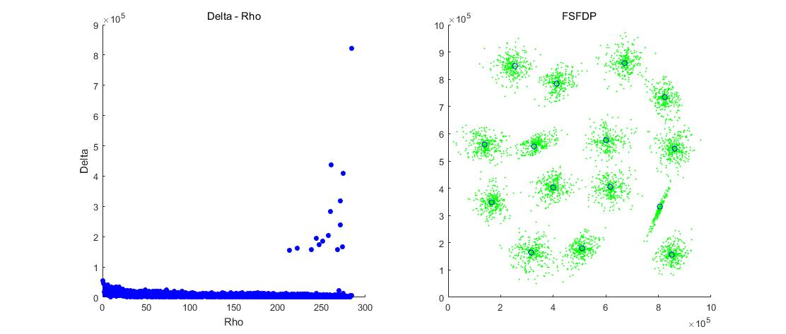

This post is about clustering. I will make a short introduction of traditional methods, then talk about a magical algorithm published by Alex Rodriguez and Alessandro Laio on [Science magazine](https://science.sciencemag.org/content/344/6191/1492.full), 2014. I call it magical because it's simple yet powerful, and super intuitive. The principle behind it is really semantic.

Clustering, as a kind of unsupervised learning method, aims to divide dataset into some pieces (i.e. "classes"), making the **intraclass difference**[^the differences of data points in the same class] as small as possible while the **interclass difference**[^the differences of data points in different classes] as large as possible.

For example, the picture bellow shows 5000 points scattered on a 2-D plane, we humans can easily assign them into 15 groups, because there is an obvious distributing pattern of these points. The question is, how could computers finish this job?


## Traditional methods

In the past few decades many algorithms have been developed just to finish this "simple" task, some of them are quite delicate and beautiful. However, depending on the rationale behind them, they all have some shortcomings like any other algorithm does. They are either slow or too complicated to implement, or just cannot finish the job.

The **C-Means** algorithm might be the most famous one of its kind. We randomly choose some points as cluster centers at first, then we assign points into some clusters by their "distance" to cluster centers, then calculate new centers to replace old ones. This procedure is accomplished by repeating those steps several times, until cluster centers do not move anymore. This method is inspirational, and many similar methods have been developed, such as **Fuzzy C-Means**, which uses a fuzzy matrix to weight the target function. This kind of algorithms are easy to implement and are simple to understand, but as been mentioned above, the initial cluster centers are very important, and results vary under different initial state. That makes these algorithms not robust enough, thus not reliable in some cases.

Another kind of algorithms are build upon statistics, such as **Guassian Mixed Model (GMM)** algorithm. It assumes that data points are just samples from some mixed Guassian models, therefore the clustering task is equal to estimate several Guassian models, to make the posterior probability as large as possible. Theoretical foundation of these algorithms are clear, mathematics makes them look reliable. However, initial state still affects the result, and most importantly, the basic assumption — "data points are just samples from some mixed Guassian models" — isn't always true. Another problem is, this algorithm could be very slow with large datasets.

Some other algorithms exist, like **Hierarchical Clustering**, which works fine under discrete feature values. It regards each points as a single cluster at first, then combines two clusters each time, repeat this step until the total number of clusters reduces to a certain level. It sounds simple, but again, it's slow with large datasets, and not robust enough.

## A new method

Algorithms mentioned above are highlights of clustering methods. Most of them are iterative methods, and could be time consuming with large datasets. People have found an acceptable principle: a good clustering method is an algorithm which can fully summarize the common features of points, while making different clusters faraway from each other.

A new method was introduced by Alex Rodriguez and Alessandro Laio in 2014, their paper was published on Science. This already indicates that their algorithm must have something special, since papers in this field are hardly seen on magazines like Science. It is worth mentioning that deep learning researches were already super popular in 2014, which makes this algorithm even more admirable — it has absolutely nothing to do with deep learning.

This algorithm is based on two principles, **only two**:

1. **Cluster centers are points with high "Local Density ($\rho$)"**
2. **Cluster centers are points with high "Relative Distance ($\delta$)"**

### Local Density

How to understand these two principles? Well, the first is relatively easy: cluster centers tends to have more points around them, than other regular none-center points. Imagine a leader of a team, or the head of a gang, they are always surrounded by many other "little guys".

For each point, we simply count the number of points around it, that is, closer than a predefined cut-distance — $d_c$:

$$\rho_i = \sum \chi(d_{ij} - d_c)$$

And we have :

$$\chi(x) = 1|_{x<0}, \chi(x)=0|_{x\ge 0}$$

Geometrically, this step equals to drawing a circle (or spherical surface with higher dimensions) using $d_c$ as radius and $point_i$ as center, then count the number of points inside the circle.

### Relative Distance

This is a little more difficult to understand. Actually "Relative distance" means "**minimum distance to points with higher local density**", that is for each point $P_i$ with local density $\rho_i$, we calculate distances between $P_i$ and any other point $P_j$ with local density $\rho_j > \rho_i$, then use the minimal distance as the "Relative Distance" of $P_i$. But WHY?

We can easily understand why we choose points with high Local Density ($\rho$) as cluster center candidates — because points around them are compact. But don't forget, another criteria is also important for cluster centers: **distance between clusters should be as large as possible**. It is reasonable, think about it: if cluster centers are too close to each other, there must be huge overlap between clusters, that usually isn't ideal result.

Again, imagine a man who want to be a leader of a team, firstly he gathered a lot "little guys", then he must want to keep distance to those "bigger bosses", otherwise he might lose in competition. The Relative Distance ($\delta$) is used to measure the distance between $P_i$ and any other cluster center candidates, as explained, this value should be as large as possible. Therefore, $\delta_i$ for $P_i$ could be calculated as:

$$\delta_i = \min(d_{ij}) |_{\rho_j>\rho_i}$$

If $P_i$ already has the biggest $\rho$, just let:

$$\delta_i = \max(\rho_j) |_{j\ne i}$$

And $d_{ij}$ means Euclidean distance between $P_i$ and $P_j$.

### Implementation

I implemented this algorithm using Matlab, guess how many lines of code does it need? 

```matlab
function [centers_o, Rho_o, Delta_o] = fsfdp(dataset_i, NumCategory_i, dc_i)
    %%%%%
    % Clustering by Fast search and find of density peaks
    % AlanDecode
    % 
    % dataset_i: N * D
    % NumCategory_i: number of categories
    % dc_i: cut distance

    %% Dataset
    dataset = dataset_i;
    datasetSize = size(dataset);
    NumCategory = NumCategory_i;
    
    %% Algorithm
    
    % Calc distance between points
    distMat = pdist(dataset);
    distMat = squareform(distMat);
    
    % Calc Rho (local density)
    Rho = zeros(datasetSize(1), 1);
    for idx = 1:datasetSize(1)
        dists = distMat(idx, :);
        Rho(idx) = size(dists(dists > 0 & dists < dc_i), 2);
    end
    
    % Sort
    [~, rhoIndex] = sort(Rho, 'descend');
    
    % Calc Delta (minimum distance between one point 
    % and any other point with higher density)
    Delta = zeros(datasetSize(1), 1);
    for idx = 1:datasetSize(1)
        if idx == 1
            % point with highest rho
            index = rhoIndex(idx);
    
            % use highest distance as Delta
            dists = distMat(index, :);
            Delta(index) = max(dists);
        else
            % current point
            index = rhoIndex(idx);
            
            % points with higher rho
            rhoIndexSlice = rhoIndex(1:idx - 1);
            p1 = dataset(rhoIndexSlice, :);
    
            % calc distance
            p2 = repmat(dataset(index, :), idx-1, 1);
            dists = sqrt(sum((p1 - p2).^2, 2));
    
            % minimal distance
            Delta(index) = min(dists);
        end
    end
    
    % Find centers, composite Rho and Delta
    Temp = Rho.^2 + Delta.^2;
    [~, tempIndex] = sort(Temp, 'descend');
    % highest [NumCategory] values
    tempIndexSlice = tempIndex(1:NumCategory);
    centers = dataset(tempIndexSlice, :);
    
    % Return
    Rho_o = Rho;
    Delta_o = Delta;
    centers_o = centers;
end
```

You can see the core part contains less than 50 lines of code, it is so concise that I even doubted myself. But the result reassured me：



Cluster centers are drawn using blue circles on the right-hand figure. And we can clearly see 15 points with high $\rho$ and $\delta$ one the left-hand figure. This algorithm is not iterative, the most time consuming step is sorting. This is inevitable though, because the sorting result is necessary for calculating $\delta$.

------

Dataset in this post could be downloaded [here](/resources/s1.txt), just load it in Matlab. It includes coordinates of 5000 2-D points.