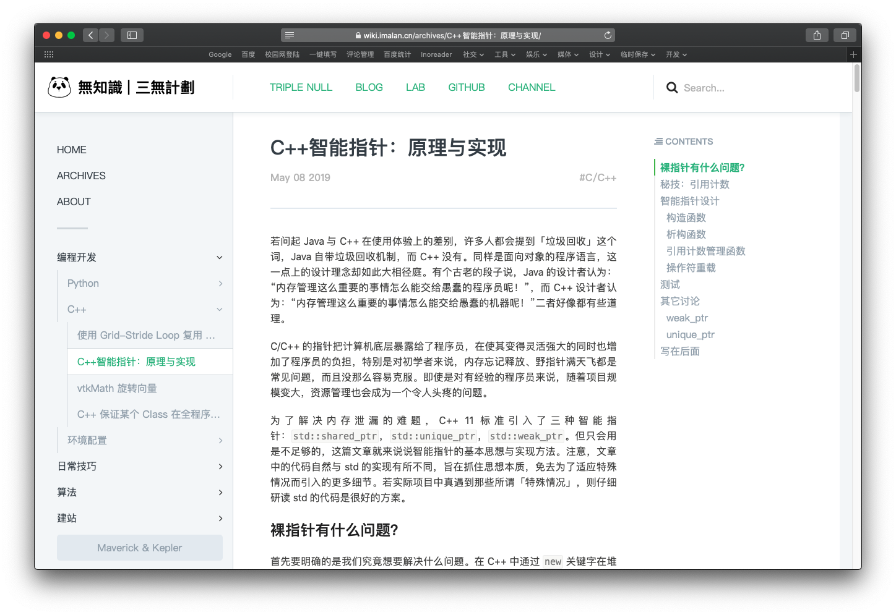
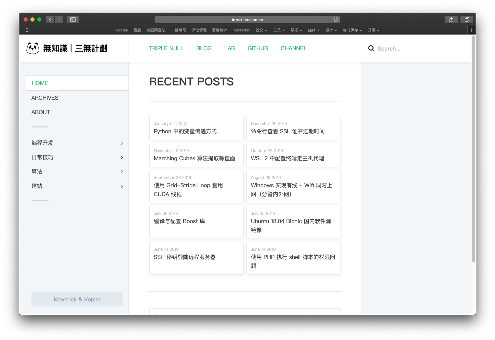
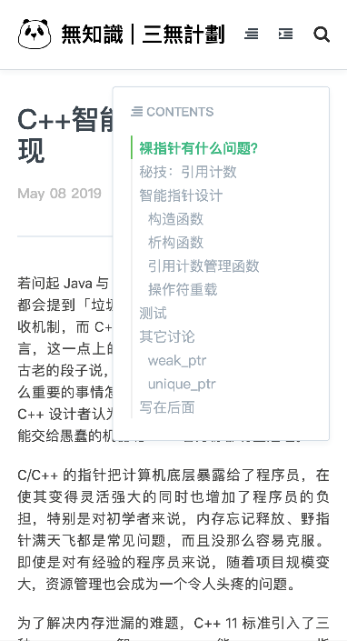
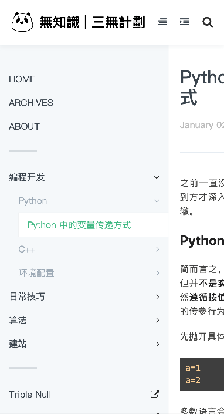

前段时间我在少数派上发了一篇[文章](https://sspai.com/post/58013)介绍 Maverick 以及基于 Maverick 利用 GitHub Actions 自动发布静态博客的流程，引来了不少踊跃的实践者。其中很多都问我 Maverick 能不能换主题？

能，确实是能；但是现在选择比较少。Maverick 自带了一款主题 Galileo，现在还有 [Zeee](https://www.velasx.com/) 写的主题 [Prism](https://github.com/Reedo0910/Maverick-Theme-Prism)。

Maverick 问世后，我就把个人博客与个人 Wiki 都迁移到了这个自主知识产权的生成器上。个人博客体验尚可；但是 Wiki 嘛……Galileo 显然不是针对 Wiki 设计的主题。因此我牺牲宝贵的工作时间，大胆摸鱼，现在就向大家呈现针对个人 Wiki 设计（照抄 GitBook）的新主题：Kepler。请前往[我的 Wiki](https://wiki.imalan.cn/) 查看效果。

[notice]Maverick 现已内置 Kepler，请升级 Maverick 为新版本，并在站点配置文件中修改 `template="Kepler"`。[/notice]

[photos]

[/photos]

Kepler 的设计来自 GitBook，也带有便利的侧边栏、文章目录、全站搜索。此外 Kepler 支持 PJAX 全站无刷新，浏览体验无比流畅；得益于 PJAX，站点成为了一个单页应用，且对 SEO 友好。

[photos]

[/photos]

Kepler 是响应式的，在平板、手机等小屏幕上均有良好体验。

---

我自己在不断探索个人知识体系的构建方法。最近几年笔记工具领域新秀层出不穷，目前最火的当属 Notion。但是我一直用不惯 Notion，它推崇的「模块化」笔记方法在我这里 makes no sense。因此看到现在印象笔记、GitBook 都开始照搬 Notion，心中感到遗憾。

一年半之前写下的 [为什么每个人都应该有自己的 Wiki](https://blog.imalan.cn/archives/108/) 中我对个人 Wiki 的期待现在也没有改变，最重要的无非两点：分类，搜索。在 Maverick 之前，我使用 Hexo 发布个人 Wiki，那时使用的主题 [Wikitten](https://github.com/zthxxx/hexo-theme-Wikitten) 各方面都相对不错。这次写 Kepler 时把 Wikitten 最核心的两点都移植过来了：侧边栏分类树以及全站搜索，并且在展现方式上仿照 GitBook 进行了大幅增强。此外增加了更实用的文章目录。

对了，关于文章分类有一点值得一提，Maverick 最近的版本中增加了 `category_by_folder` 选项，也就是可以根据文件目录结构确定文章分类，不用纠结于 `front-matter`。这个功能搭配 Kepler，我认为体验甚至优于 GitBook（个人自吹，不要试图在评论区纠正我），希望你们能喜欢。

那么，就到这里。新年快乐。