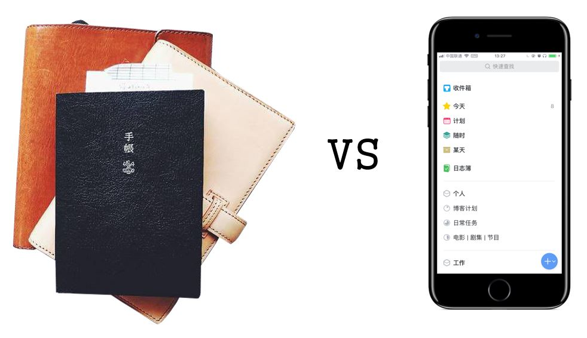
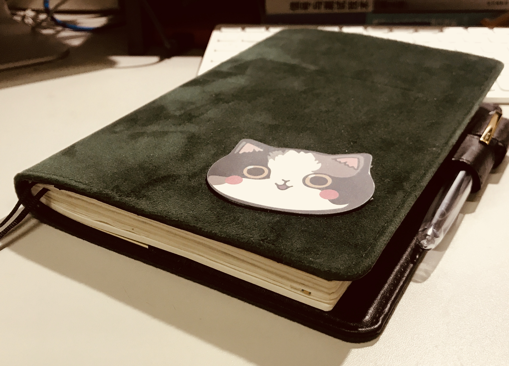

最近因为上研以及其它学业上的事，非常忙碌。虽然最后结果不坏，但也没有什么沾沾自喜的感觉。自己又开始多项个人计划，都在紧锣密鼓地推进中。期待今年年末回顾时会发现 2017 下半年值得自己骄傲。

这半年，除了捡起了自己读书的爱好之外，还入了「手帐」这个坑，如今已成了手帐足月生。时间虽短，但使用的过程中我一直保持思考：我为什么要写手帐？手帐能带给我什么特别的东西？

「手帐」的概念在中国其实非常宽泛：日程本、日记本、账本，甚至读书笔记、观影体会都可以叫做「手帐」，也都有人玩得很棒。我是一个电子设备爱好者，以上所说的每一点，基本上在我的电脑、手机、iPad 上都有对应的工具可以实现；但我又无法无视网络上手帐达人们 PO 出来的自己的手帐照片，有的秩序井然，有的相当随性。但无论哪种，作者都宣称自己的生活因为手帐而得到了改善，甚至直接因为手帐而更热爱生活。我不能抵抗这种诱惑。

另外我想说明，我看到了不少我觉得并不是「手帐爱好者」，而直接是「文具爱好者」的例子。虽然二者之间可能有很高的重合率，但我认为二者应该分开来讲。我憧憬的应该是专注于手帐内容、创意、排版的达人们；对拥有极大量钢笔、胶带、本子、书衣、贴纸等道具的达人们我只静静地表达一下自己的敬意。

我先后尝试了将手帐作为日程本、日记本、观影体会本来使用。现在的结果是：完全抛弃了日程本这个用法，日记本用起来不错，观影体会我还在体会中，在这里我迫不及待想要来分享一下我的感受。但我不想把这篇随笔变成只抛出立场的「站队文」，因为我确实意识到，这个过程相当受个人因素的影响。

## 日程安排还是在电子设备上做好一些

手帐作为日程本来使用应该是最为广泛的一种用法。为了将这种用法优化到极致，产生了 [Bullet Journal](http://bulletjournal.com/) 这种专门的手帐术，也催化出了专门为此而设计的手帐本内页，如 [DIY Fish](http://www.diyfishblogs.com/diyfish/category/blog/) 活页内芯等等。

> 课间或者通勤路上，随手掏出一个小本子查看自己今天的安排或者来安排自己接下来的行程，一整天因为良好的计划安排而井井有条。

这是一个相当美好的描述，但不太适用于我。最大的原因大概是我做不到随身掏出一个本子同时掏出一支能写的笔来（笑）。说正经的，用本子来进行日程安排，最大的优点应该是录入快捷，纸笔用起来更顺手。不过其它的我认为一个任务管理系统应该具有的特性，纸笔实现都要欠缺一些。以我目前的任务量，一个任务管理系统应该具有的特性有：方便的录入环节；通知；任务推迟、提前、重复、删除、归档；基于项目与场景的整理方式。

纯粹的纸笔无法满足以上的大部分条件。通知自不必说，想要不漏掉任务记在本子上就要求自己随时去看它。任务的迁移很容易让本子变得一团糟，虽然像 Bullet Journal 这样的手帐术专门制定了任务推迟的书写规范（用一个小箭头来表示推迟，然后在相应日期重新录入），但直观性与便利性与在手机上拖拽或者点击一下推迟不可同日而语。在本子上也难以把任务按照项目或场景来整理，二者总是难以兼顾。

在这一点上，可以说电子产品把我惯坏了，也可以说崇尚数字效率生活的[少数派](https://sspai.com/)把我惯坏了。我已经习惯了在手机上利用 Todoist 或者 2Do 或者 Things 或者别的什么 App 来进行简单的任务管理，虽不能说用得非常深，但用来管理自己的小生活也挺得心应手的。所以最终我放弃了用手帐本来进行日程管理。

## 那就来做日记本吧

抛弃了手帐的效率用法之后，找到了还算舒服的用法：写日记。这部分我用的本子是 Hobonichi A5 一日一页。我原本就有在 Day One 里每天写日记的习惯，所以转到本子上来写不会有太大的习惯上的转变。

在本子上写起日记来有特殊的快感，因为可以相当随意的发挥：纸面上，做怎样的排版都看自己，用胶带、图片随意装饰，可以随意张贴小票、照片等等，心情好了还能画上两笔。手上握着一只喜欢的钢笔在纸面上书写，相比起在 iPhone 的虚拟键盘上敲字，心里面觉得实在得多。看着随着自己的使用，张贴了不少图片的本子慢慢厚起来，心里面有一种成就感。

在写日记这件事上，我没有那么功利。我明白 Day One 能提供很多不错的特性：标签、搜索、那年今日等等，但我不太觉得这些是写日记时必须的特性。在我心里面，日记是一种比较仪式性的东西，在桌子前正襟危坐，把自己不会对别人说的一些不着边际的话说给本子听，翻过一页或者合上本子，日记本就像一位最沉默可靠的朋友，倾听我发牢骚、帮我保守住秘密。我不会刻意地去查阅我在日记里写的东西，需要查阅的东西我会记在备忘录里、印象笔记里，我翻看日记的方式就是随意翻到一页，体会当时写下这些字的自己是怎样的心境。

装饰手帐是另一种乐趣。许多人喜欢用很有特色的贴纸、胶带来装饰手帐，精心设计排版，效果非常赏心悦目。这个我只能靠看别人的照片来体会了，因为是设计排版白痴，字也写得非常马马虎虎，看自己的版面很难有「赏心悦目」的感觉，不过毕竟是自己写的，还是挺喜欢的。

在本子上写日记，一个问题是会花更多的时间。这就看个人对这件事愿意投入多少了。如果足够看重这件事，少看一集动漫，挤一挤时间总还是有的。

## 所以有没有让我「更热爱生活」

我记手帐的时间可以算是短得可怜，目前难以说能看到什么深刻的改变，写这篇随笔，是因为一些结论不需要太久的体验就能总结出来。而「有没有更热爱生活」这个问题，需要更久的体验。

但手帐让我每天都有一段时间是在桌前，平心静气面对纸面，总结自己的一天，记录自己的所思所想，顺便厘清自己可能一团糟的大脑。不需要非常长的一段时间，在这段时间里放下冰冰凉凉的 Unibody 铝合金机身的设备，关掉刺眼的电子设备屏幕，在沙沙的书写声中我确实能感到一种心安。
