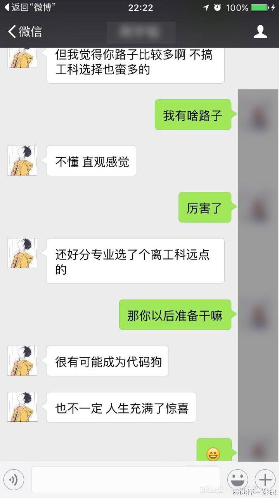

一、

从上学期（2017下半年）我搭建这个博客开始，关于页面里的自我介绍就是“即将上研的首都大学生”，如今到了2018年中旬，毕业才真正地临近了。

我的一些不同学校的朋友，许多已经走完了毕业流程，开始了毕业后的生活。毕业旅行也好，找工作进入职场也好，实习也好，大家都开始了人生的一个新阶段。我真心为他/她们感到开心。

我的接下来两年的路径大致已经确定，就是读研，搞科研，精进技术，然后去做一份开发工作。虽然是半路出家的野生程序员，但是对开发的热情渐浓，目前所考虑的路径就如上了。

我不是一个很爱做计划的人，或者不如说，我不是一个很能遵循计划的人。今天早上有位朋友在一条旧微博下面@我，给我看两年前的一张聊天截图：

人生充满了惊喜，这句话永远都是对的。虽说我两年对自己的预言如今多半成真了，但实现过程中零零碎碎的过程还是无法预料，既然无法预料，那就不要想着去掌控一切，做自己觉得正确的事，享受生活给自己的惊喜就好了。

二、

最近，学院要求应届生做一个 presentation，总结大学四年的收获遗憾。我本是不 care 的，知道这是一项政治任务，但是在展示现场，看同班同学一个个上台展示，把一些陈年老照片拿出来展示，还是难免有些感慨。四年的时间，比初中长，比高中长，但却给我留下了远不如初高中深刻的印象。一个侧面展示出我这四年多少还是不够充实吧。

不过从个人成长的角度来说，除了体重从120斤突飞猛进到150斤外，思想境界也有了不错的长进。不是说我脑子里多了多少知识，而是我思考问题的方式在朝我理想中的方向前进，这是最重要的。

一个特点没有改变，就是对感兴趣的事情充满了热情，一定要做到最好，做到自己满意为止。

三、

大一军训把过眉毛的长发（毕竟男生，还挺长的）剪成了不到 5mm 的寸头之后就再也没有搭理过头发的事情，大概是没有了女朋友，也没有太多交际，对自己的外在形象就没那么在意了。如今想要把头发再留回来，遮一下日渐宽广的额头，另外也提醒自己：不过20多岁而已，I still have every reason to be young。

我的头发一旦处于不长不短的状态时就会乱翘，非常不服帖，最关键的是，还只是一部分乱翘、不服帖，另一部分却乖乖的。索性去烫了头，现在所有的头发都乱翘，满意。

胡子也是一周也不刮一次。今天用电动剃须刀试着刮了一下，发现胡子太长，缠住了刀片，扯得疼得不行，只好用刀片手动刮了。

四、

过去四年，浪费了两年。其余两年受了拖累，没有做任何真正酷的东西。如今是一个契机，我希望能够从事真正有趣的工作。没有什么比兴趣更能激发我的潜力。

大概会参与一些开源项目，甚至自己启动一两个也说不定，把浪费的时间补回来。学习手绘，学习日语，谁知道呢？