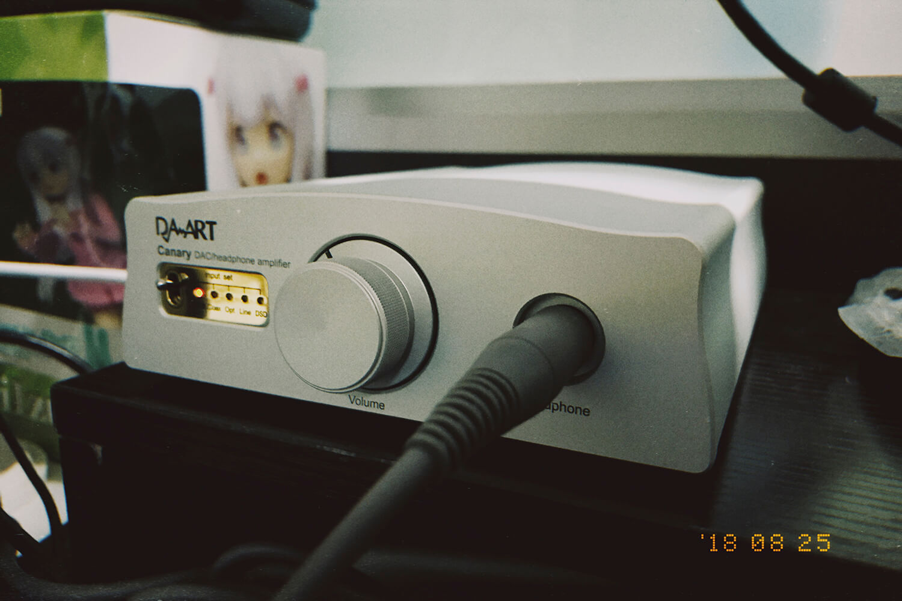

事出有因，这个暑假我开始每天跑步，自己建了一个跑步歌单，里面一首《Don't Say "Lazy"》我快听了上百遍才知道原来是《轻音少女》的 ED。平日里写代码全靠耳边的音乐进入状态，之前买过的耳机都出手了，一直靠 iPhone 自带耳机凑合，总觉得差点意思。就想着物色一个新的耳机。

找来找去目光锁定在因为《轻音少女》的播出而大火的「大手办」K701 上。据说难推，难推有什么？手办手办，看着都开心。

给耳机开个光：

[photos]

[/photos]

## 一耳朵听感

不得不说，难推是真的，耳机带了 3.5mm 转接头，首先试试直推。往笔记本上一插声音是真的小。我是不懂内部原理，反正不是功率不够就是电流不足，听感比较混沌。当然即使推不好也比我的 EarPods 强一个档次，但肯定不算是网上流传的那种评价。

听 ACG 的话还可以，其实只要是整体在中间偏高频的曲子都还可以。太高的频率下也会比较虚无缥缈，以及一点点刺。

动次打次就比较难受了，因为确实低频比较无力。据 HIFI 大佬们说上个 5K 左右的前端能推好低频，我是不太同意这个说法的。这个耳机本来特性就是这么个特性，非要上各种设备把它弄成另一副耳机的感觉，再美其名曰「推好」，有点神经病吧……

我平日里听得最多的还是后摇。直推的情况下，会比较混沌一点，细节不是很充分。许多后摇都有很宏大的场面感，这个比较考验耳机的素质，大手办表现得中规中矩。

在耳机没有煲开前，发声元件物理上没有充分地震动舒展过，音色与使用了一两个月后肯定是不同的。反正据说 K701 是潜力巨大的耳机，那就慢慢看吧。一耳朵下来，素质肯定符合千元大耳的水平。

[photos]

[/photos]

## 配合钰龙金丝雀

一般来讲，某些耳机因为阻抗等物理特性，需要较大的功率或者较高的电流来支撑，而普通的输出端，例如电脑的耳机孔，手机的耳机孔等没有办法提供这样的输出，这就诞生了「耳放」这种东西，用来辅助提高功率或者电流，这是我所理解的耳放。HIFI 玩家还有更多的说法，考究实在太多，我不懂也觉得不必要搞懂，所以我不会去烧线材啦，电源啦什么的，对我来说毫无性价比可言。但耳放是我觉得有必要考虑一下的东西，因为它带来的改变比较明显，简单来说，投入产出比相对较高。

K701 出厂是 6.3mm 接口，买的人心里应该有点数。网络上的评价无一例外地说换了前端之后 K701 能变成另一副耳机，变化相当大。但是前端的事，就太玄了。HIFI 穷三代，我不可能上万元设备推一个 1K 的耳机……

多方考量之后入了一只钰龙金丝雀来搭配，据说这是 1K 左右性价比之选。也有不少人推荐仿刺猬（SAC K1000 仿制品），但是既然是仿制品，成品质量对制作者的水准要求很高。非工业生产线产品踩雷风险显著增高，权衡之下就没有选择仿刺猬。

[photos]

[/photos]

加上耳放之后，一耳朵能听出不同，我着重用两首曲子做了对比（为了方便放了网易云音乐上的版本）：

《 Alone(2)》 by Sopor Aeternus

[Meting]
[Music server="netease" id="27725389" type="song"/]
[/Meting]

《阿西达卡传奇》 by 久石譲

[Meting]
[Music server="netease" id="571336513" type="song"/]
[/Meting]

其中《 Alone(2)》 这首曲子音色很丰富，高频分量比较多一些，整体感觉是更稳一些，高频毛刺明显减少了很多；《阿西达卡传奇》这首曲子有点交响乐的感觉，能听出更多的细节，混在一起的情况减少了一些。总的来说，一千块钱左右还是比较值得。

我是直接 USB 口连接金丝雀作为解码耳放一体机使用的，坊间传闻金丝雀作为耳放的实力要更强一些。其实它本身也提供了接口，可以单独用作耳放，但是我受限于预算不准备再单独买解码了。目前的效果已经达到了我的预期。

------

说说 HIFI 吧。HIFI 被认为是典型的烧钱爱好，一个耳放，一个解码器就各能烧去上万元，最重要的耳机更是有「八千听个响，万元入个门」这种吓死人的说法。

但我觉得不必要把 HIFI 搞得这么妖魔化。大多数人买好一点的耳机，就是图个听感更好，或者就是样式好看。19.9 包邮的耳机到 100 块的耳机，听感可以有很大的进步；100 的耳机到 1000 的耳机，听感变化就不一定有前者明显；1000 到 10000 呢？我也听过上万的耳机，我觉得以普通人的需求来说，是不必要的。更不提线材、耳放、解码、电源这些东西，对一个平日玩一点游戏、看点影视剧、听一点流行乐的普通用户来说，有一个是一个，都是没必要的。

耳机这种东西，终究是服务于人的。有人喜欢造型好看能出街的，那他就花 2000 买 Beats；有人整天乘飞机坐高铁，那就买 QC35 来隔音；有人手上苹果设备比较多，又不喜欢有线耳机，那就花 1000 买 AirPods；有人就是发现买电脑送的耳机听得头疼，花 100 买个淘宝爆款，又有什么不合理呢？非要回怼说 Beats 真正的音乐地摊假货音质更好，AirPods 白开水买就是交智商税，有意思没有？

用自己觉得舒服的设备，听自己喜欢的音乐，才是硬道理。