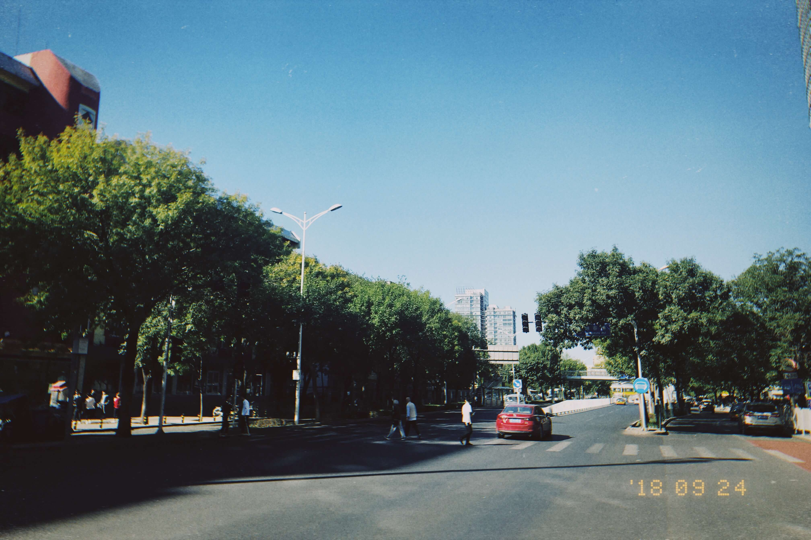

一进入九月，雷打不动的是过敏。自来京后每年春秋都会过敏，折腾了我好几年。如今竟逆来顺受，提前备好了抗敏药，就等症状袭来。像在等一位老朋友似的。

另外则是气温以可感知的速度下降。北京少雨，但今年降水似乎多一些。昨天下午开始带着雷声刮起大风，短暂地下了一场阵雨，至晚上则彻底开始下大雨。不巧的是当时我正与朋友们聚会，定好了饭局结束后去唱歌，结果一行人堵在饭店门口看着大雨一筹莫展。叫车无人接单，最终还是凑在一起打着伞说说笑笑一路走去 KTV，衣服、鞋子、书包都湿得差不多了，但好在一路朋友相伴，不觉得寒冷。 

一场秋雨一场凉，瞥了一眼手机，今天最低气温仅 8 度。也许是托身上脂肪的福，我从今天才开始在短袖外面套上帽衫。其实我觉得不穿外套也无妨，只是没必要在此事上较劲，况且就观感来说，我个人最喜欢的还是春秋季的衣物。昨天和朋友说，我觉得我的身体是越来越好了：高中时不穿秋裤根本过不下去，但大学四年我有三年都仅靠一条牛仔裤过冬，上衣则是内外两件即可。今年我觉得不能大意，还是要老老实实做好保暖。

[photos]

[/photos]

算起来，这是我在北京度过的第五个秋天。有件事很有意思：以我学生的身份来说，一年四季的象征意义有些反常。由于秋季是新学年的开学季，可算是「开始的季节」；而春季往往象征着一学年即将结束，反而是「收获的季节」；一直来的夏季都是「玩耍的季节」；冬季则可以单独另说。今年夏季仅与老友见面二三次，而往常是整个暑假每天都厮混在一起，果真是人生的某个阶段已经彻底地离我们远去了。

北京一入秋总要起风。万里无云，阳光极好，同时伴着大风。海淀区尚且如此，遑论昌平沙河等地。刚开始起风尚且算温和，随着时间进入十月、十一月，凉爽的风逐渐变得凛冽起来，吹得生疼，到那时谁也不愿意在室外呆太久。现在室外正是大风，能听到树叶哗哗地响。

------

今天本准备写一写近况，也就是「最近的一点 Update」那样的文章。但写了两三段觉得索然无味，无非是千篇一律的吃饭、睡觉、上课、敲代码，再者就是又在玩什么电子产品，若再这么下去恐怕我对自然的敏感度会逐渐降低，因此就随意写了这一篇不知所云的短文。趁着国庆小长假机会难得，出门去体会一下北京这座老城的秋天，也不失为一个好选择。