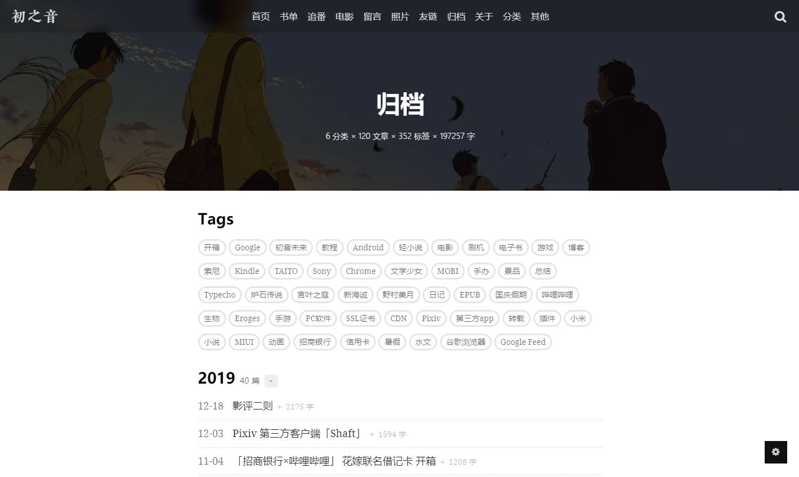

作为计算机术语时，VOID 的意思是「无类型」。在本文中，它是由我开发并开源的第二款 Typecho 主题。

写本文时距离我发布上一款也是第一款主题 RAW 并不久。一开始我对 RAW 很满意，但它逐渐成为了我的试验田、游乐场，而不是一个可以给大家使用的作品。一团乱麻的代码，不甚合理的设计，冗余过度实用不足的功能集，让维护与进一步开发变得没有乐趣可言。

回头想想，这几个月通过开发与维护 RAW 也学到了不少东西，认识了不少朋友。当它无法为我带来更多的乐趣时，我意识到 RAW 在我这里的使命已经完成，是时候前进了。

[notice]博客交流群已建立，目前处于无人打理的自由水状态，欢迎进群讨论：777536599。Telegram 群组：[进群](http://t.me/imalanblog)[/notice]

------

> 🐒 猴子打字机原理的产物

VOID 是我从头开发的全新作品。开发过程中借鉴了 Ghost 默认主题 [Casper](https://demo.ghost.io/) 与水八口开发的 Bitcron 主题 [Card](https://blog.shuiba.co/bitcron-theme-card)。

VOID 中图片的展示占了很大的比重，首页上文字量很少，一眼看过去是十来张图片。另外，你或许会有这样的感觉：VOID 这个主题方方正正的，显得很端庄的样子。确实是这样的，主题中圆角很少，不规则的图形也很少。

这其实是我自己动的一点小心思。

既然是挂上了 MIT 许可的开源项目，自然就没有立场干涉别人怎么用。但多少是自己的作品，心底里对别人如何使用它还是有所期待的。DIYgod 在[关于开源项目赞助这件事](https://diygod.me/open-source-project-donation/)里提到 DPlayer：

> ...再加上用户大多是盗版站和小黄站，这曾一度让我产生了弃坑的想法。

若要我说出最诚实的想法：我希望使用这些主题的博主，能认真地多写几篇正经文章，这才是独立博客的精髓。一两句话的牢骚，大可以去微博与 Twitter 上说；花花绿绿的代刷广告与盗版采集还是免了吧。

「媒介即讯息」。虽然这句话放在这里不甚恰当，我实际要表达的意思是主题的形式能在一定程度上影响作者的产出。VOID 的排版很规整，可以用来修改的空间并不大，甚至连个广告都很难找到合适的地方放。再加上图片占了很大比重，若是不认真对待，恐怕用这个主题的结果就很难看了。

这是自损八百的做法：我丢失了一部分潜在的使用者。但并非不值得。

去除了繁杂的功能、版式，最终还是回归到文本上来。如何使网页可用性更高是一个很大的话题，涉及到排版、无障碍等等方面。VOID 的文字样式使用 Lepture 的项目 [yue.css](https://github.com/lepture/yue.css)，经过我的反复考虑，这个 CSS 集应用到内容块上效果很好。有一个小的改动：原项目的字体默认大小是 18px，综合考虑下 VOID 使用了 17px。相比起 RAW，以及其他许多主题，应该能感觉到 VOID 的文字可读性要高得多。

无障碍这一块 VOID 现在做得不好。主要是因为我主业并非前端，全凭兴趣，某些[基础修养](https://lepture.com/zh/2015/fe-aria-label)尚有欠缺。这将在后续的维护中逐步提升。

我不准备在这篇文章中详叙 VOID 的使用方法与功能，罗列功能是一件很无聊的事情。这部分内容请参阅主题的 GitHub 主页：[AlanDecode/Typecho-Theme-VOID](https://github.com/AlanDecode/Typecho-Theme-VOID/blob/master/README.md)，功能更新与 bug 修复记录请查看 GitHub 上的[提交记录](https://github.com/AlanDecode/Typecho-Theme-VOID/commits/master)。

[notice]鉴于目前我没有再使用 VOID，这里放上几张截图，供参考[/notice]

[photos]

[/photos]

[photos]

[/photos]

[photos]

[/photos]

VOID 是响应式的：

[photos]

[/photos]

[photos]

[/photos]

------

其实基本的思考是：独立博客到底应该是什么样的。

这个问题我无法回答，恐怕叱咤独立博客界 17 年之久的 [Daring Fireball](https://daringfireball.net/) 作者 John Gruber 也给不出让所有人信服的回答。这个问题大概本来就没有答案。

互联网发展到现在，带宽、内容丰富程度都与 20 年前不可同日而语。独立博客这样需要坐下来花上个把小时写文章的介质实在很难与 GIF、视频、emoji 抗衡。

作为一个写主题的人，能做的只有为博主带来无障碍的写作环境、为读者带来无障碍的阅读环境。不要去打击博主可能的创作欲，也不要给想获取信息的读者平添难度。

你觉得这简单吗？这一点也不简单。
