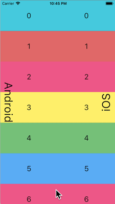

话说自从将日常机换成了 Mac，各方面都爽，只有鼠标差点意思。

我知道 Mac 触控板很强，实际上我用触控板也用得很溜，由于没有找到合适的鼠标解决方案，这几个月确实也是完全脱离鼠标的。但是总有不得不用鼠标的时候，比如一些精确快速的操作。

### 指针

我习惯在 Windows 上将指针速度调到很高，然后享受那种指哪打哪的感觉，但是 Mac 上的指针默认是带加速度的，在接近目标时指针速度会变慢，这真的让我很难适应。好在一番搜索之后发现可以通过以下几个参数调整 Mac 的指针属性：

- 鼠标双击阈值：com.apple.mouse.doubleClickThreshold
- 鼠标加速度：com.apple.mouse.scaling
- 滚动速度：com.apple.scrollwheel.scaling

在终端读取以上的数值：

```bash
defaults read -g [变量名]
```

在终端设置以上数值：

```bash
defaults write -g [变量名] [值]
```

设置完成后重启电脑生效。其中 `com.apple.mouse.scaling` 的默认值是 1，将其设为 0 之后鼠标指针就没有加速度了，效果和 Windows 比较相似。

### 滚动

Mac 触控板是带有平滑（惯性）滚动的，使用起来非常自然，但是换用鼠标就没有了……好在我发现了这个 App：[Mos](https://mos.caldis.me/)，它可以给鼠标滚轮也添加惯性滚动，效果拔群。另外，这个 App 也可以用来单独翻转滚轮方向而不影响触控板方向，更符合使用习惯。它甚至还可以录制滚动曲线：

![][1]

------

一句题外话，Mac 触控板，或者说苹果全系产品触控体验都很好，一大原因是有优秀的惯性滚动算法加持。下图展示了 iOS 与 Android 的惯性滚动算法差异：

[photos]



[/photos]

图源：[@XiNGRZ](https://weibo.com/1260797924/HtiRdtMJm)

给人的感觉是 Android 是愣快，没有舒适的过渡。许多 iOS 用户难以适应 Android 的一部分原因就是这个。


  [1]: ./assets/4066843749.png